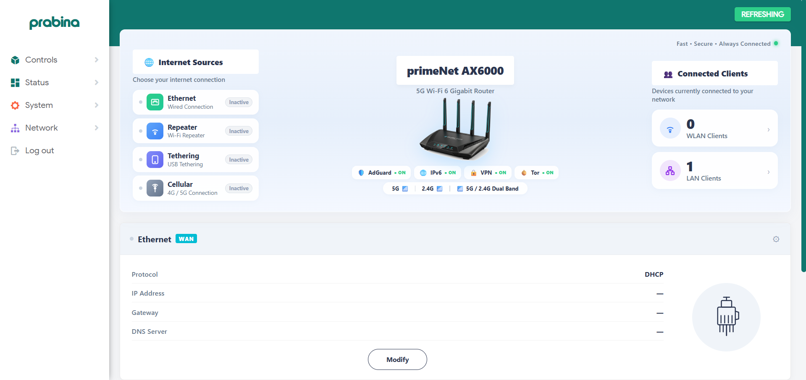
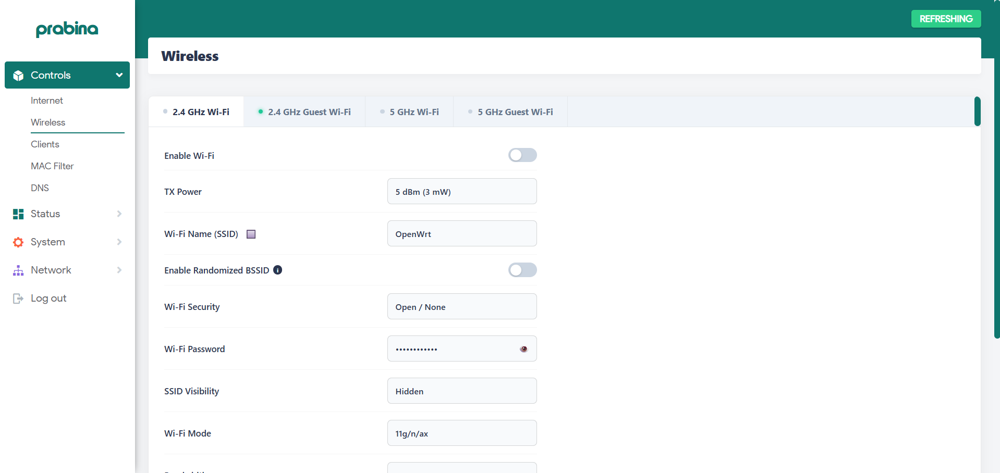
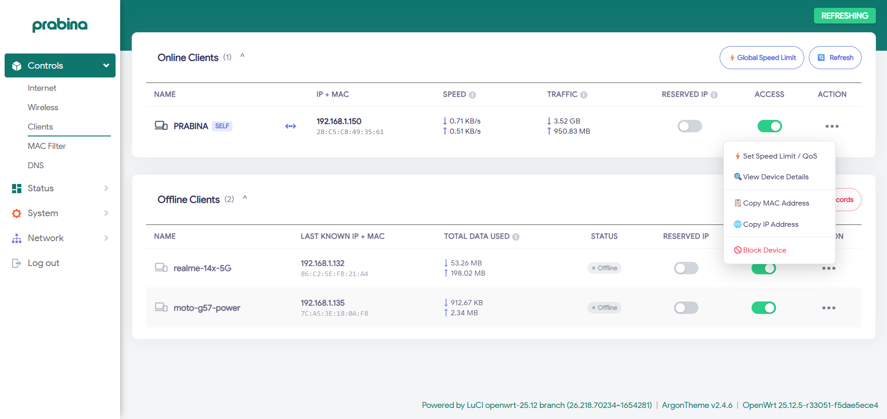
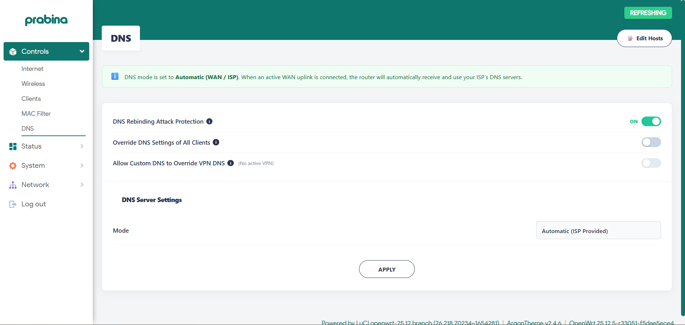
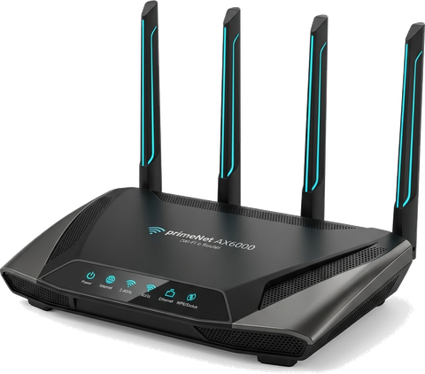

# 👑 Queen — Modern Production-Grade OpenWrt Management Suite

[](https://openwrt.org)
[](https://github.com/openwrt/luci)
[](theme/)
[](LICENSE)

**Queen** is a modern, high-performance, and visually refined management suite for **OpenWrt** routers. Paired with a customized **Argon Theme** (tailored teal aesthetic, dynamic Bing daily wallpaper, glassmorphism blur, and dark mode support), Queen provides end-to-end hardware control, live client accounting, multi-band Wi-Fi management, dynamic DNS controls, enterprise-grade Dual-WAN Load Balancing, and network topology monitoring.

---

## ⚡ Quick Start: Download & Apply Everything

You can install both **Queen** and the **Argon Theme** (with full custom color/wallpaper configuration) using **any** of the following methods. Just copy and paste the commands into your router's SSH terminal.

---

### 🚀 Method 1: Instant 1-Command Automated Install (Recommended)

SSH into your router terminal and copy-paste this single command:

```sh
sh -c "$(wget -qO- https://raw.githubusercontent.com/dev-prabina/openWRT/main/scripts/install.sh || curl -sSL https://raw.githubusercontent.com/dev-prabina/openWRT/main/scripts/install.sh)"
```

> **What this does automatically:**
> 1. Detects package manager (`apk` or `opkg`) and installs prerequisites, `mwan3` multi-WAN engine, and `luci-theme-argon` + `luci-app-argon-config`.
> 2. Applies the tailored Argon theme configuration (`#0F766E` primary teal, `#81C784` dark accents, 16px glassmorphism blur, Bing daily wallpaper).
> 3. Downloads and deploys all 6 backend RPCD ucode plugins (`luci.internet`, `luci.wireless`, `luci.clients`, `luci.macfilter`, `luci.dns`, `luci.loadbalance`).
> 4. Deploys all 6 frontend LuCI views to `/www/luci-static/resources/view/queenx/`.
> 5. Installs the **Controls** sidebar menu route, security ACL definitions, and router hardware assets.
> 6. Configures multi-WAN load balancing & health failover with persistent flash data-usage accounting.
> 7. Reloads `rpcd` and clears the LuCI template cache.

---

### 📦 Method 2: Git Clone & Apply (Standard Workflow)

If you prefer to clone the repository onto your router:

```sh
# 1. SSH into your router
ssh root@192.168.1.1

# 2. Clone the repository to /tmp
cd /tmp
git clone https://github.com/dev-prabina/openWRT.git

# 3. Run the installer script
cd /tmp/openWRT
sh scripts/install.sh
```

---

### 🎨 Method 3: Argon Theme & Configuration Only (Copy-Paste)

If you only want to install and configure the tailored **Argon Theme**:

```sh
# Step 1: Install Argon packages
apk add luci-theme-argon luci-app-argon-config 2>/dev/null || (opkg update && opkg install luci-theme-argon luci-app-argon-config)

# Step 2: Apply tailored Queen Argon theme configuration
uci -q batch <<EOF
set luci.main.mediaurlbase='/luci-static/argon'
set argon.@global[0]=global
set argon.@global[0].primary='#0F766E'
set argon.@global[0].dark_primary='#81C784'
set argon.@global[0].blur='16'
set argon.@global[0].blur_dark='16'
set argon.@global[0].transparency='0.9'
set argon.@global[0].transparency_dark='0.8'
set argon.@global[0].mode='light'
set argon.@global[0].online_wallpaper='bing'
commit argon
commit luci
EOF

# Step 3: Refresh cache
rm -rf /tmp/luci-indexcache* /tmp/luci-modulecache*
```

---

### 💻 Method 4: Copy from Your PC to Router (SCP / Offline)

If your router does not have direct internet access:

#### From Windows (PowerShell):
```powershell
# In the folder containing Queen on your PC:
scp -r .\Queen\* root@192.168.1.1:/tmp/Queen/
```

#### From Linux / macOS Terminal:
```bash
# In the folder containing Queen on your PC:
scp -r ./Queen/* root@192.168.1.1:/tmp/Queen/
```

#### Then on the Router SSH Terminal:
```sh
ssh root@192.168.1.1
cd /tmp/openWRT
sh scripts/install.sh
```

---

### 🛠️ Method 5: Full Step-by-Step Manual Copy-Paste

```sh
# Step 1: Install prerequisites & Argon theme
# On OpenWrt 25.x (apk):
apk add ucode ucode-mod-fs ucode-mod-uci ucode-mod-ubus iwinfo luci-theme-argon luci-app-argon-config
# On OpenWrt 24.x (opkg):
opkg update && opkg install ucode ucode-mod-fs ucode-mod-uci ucode-mod-ubus iwinfo luci-theme-argon luci-app-argon-config

# Step 2: Configure Argon theme colors and Bing wallpaper
uci -q batch <<EOF
set luci.main.mediaurlbase='/luci-static/argon'
set argon.@global[0]=global
set argon.@global[0].primary='#0F766E'
set argon.@global[0].dark_primary='#81C784'
set argon.@global[0].blur='16'
set argon.@global[0].blur_dark='16'
set argon.@global[0].transparency='0.9'
set argon.@global[0].transparency_dark='0.8'
set argon.@global[0].mode='light'
set argon.@global[0].online_wallpaper='bing'
commit argon
commit luci
EOF

# Step 3: Create required system directories
mkdir -p /usr/libexec/rpcd /www/luci-static/resources/view/queenx /usr/share/luci/menu.d /usr/share/rpcd/acl.d /etc/config

# Step 4: Copy backend RPCD plugins
cp /tmp/openWRT/sections/internet/luci.internet         /usr/libexec/rpcd/luci.internet
cp /tmp/openWRT/sections/wireless/luci.wireless         /usr/libexec/rpcd/luci.wireless
cp /tmp/openWRT/sections/clients/luci.clients           /usr/libexec/rpcd/luci.clients
cp /tmp/openWRT/sections/mac-filter/luci.macfilter     /usr/libexec/rpcd/luci.macfilter
cp /tmp/openWRT/sections/dns/luci.dns                   /usr/libexec/rpcd/luci.dns
cp /tmp/openWRT/sections/loadbalance/luci.loadbalance   /usr/libexec/rpcd/luci.loadbalance

# Step 5: Copy frontend LuCI views
cp /tmp/openWRT/sections/internet/internet.js           /www/luci-static/resources/view/queenx/internet.js
cp /tmp/openWRT/sections/wireless/wireless.js           /www/luci-static/resources/view/queenx/wireless.js
cp /tmp/openWRT/sections/clients/clients.js             /www/luci-static/resources/view/queenx/clients.js
cp /tmp/openWRT/sections/mac-filter/macfilter.js       /www/luci-static/resources/view/queenx/macfilter.js
cp /tmp/openWRT/sections/dns/dns.js                     /www/luci-static/resources/view/queenx/dns.js
cp /tmp/openWRT/sections/loadbalance/loadbalance.js     /www/luci-static/resources/view/queenx/loadbalance.js

# Step 6: Copy menu routes, ACL permissions & assets
cp /tmp/openWRT/components/menu.json /usr/share/luci/menu.d/luci-app-queenx.json
cp /tmp/openWRT/components/acl.json  /usr/share/rpcd/acl.d/luci-app-queenx.json
cp /tmp/openWRT/assets/primenet_router.png /www/luci-static/resources/primenet_router.png

# Step 7: Set correct system permissions
chmod 0755 /usr/libexec/rpcd/luci.*
chmod 0644 /www/luci-static/resources/view/queenx/*.js /usr/share/luci/menu.d/luci-app-queenx.json /usr/share/rpcd/acl.d/luci-app-queenx.json

# Step 8: Reload services & clear LuCI cache
/etc/init.d/rpcd reload
rm -rf /tmp/luci-indexcache* /tmp/luci-modulecache*
```

---

## 🔍 Verification & Health Check

After applying the configuration, verify that all backend RPC endpoints, views, and theme settings are active:

```sh
# 1. Verify active RPCD endpoints
ubus list luci.*

# 2. Test live data response from backend
ubus call luci.internet get_network_info
ubus call luci.wireless get_wireless_info
ubus call luci.loadbalance get_status
ubus call luci.dns get_dns_info

# 3. Check Argon theme active configuration
uci show argon
uci get luci.main.mediaurlbase
```

Now open your web browser and visit:
👉 **[http://192.168.1.1/cgi-bin/luci/admin/queenx/internet](http://192.168.1.1/cgi-bin/luci/admin/queenx/internet)**

Log in to LuCI. You will see the **Controls** category at the top of your sidebar styled with the custom Argon theme.

---

## 🌟 Feature Breakdown

| Section | Description | Live Endpoint |
| :--- | :--- | :--- |
| **🌐 [Internet](sections/internet/)** | Real-time multi-uplink topology (WAN, USB, WWAN, Cellular), live Ethernet port visualizer, 1-click Wi-Fi Repeater scanning & connection wizard. | `/admin/queenx/internet` |
| **📡 [Wireless](sections/wireless/)** | Multi-band Wi-Fi management (5GHz, 5GHz Guest, 2.4GHz, 2.4GHz Guest), hardware TX power (up to 30 dBm), WPA2/WPA3 security, instant QR-code generator, isolated guest APs. | `/admin/queenx/wireless` |
| **👥 [Clients](sections/clients/)** | Live online client tracking, MAC-persistent traffic accounting (TX/RX MBs), per-client download/upload QoS rate limiting, offline device manager with bulk removal. | `/admin/queenx/clients` |
| **🛡️ [MAC Filter](sections/mac-filter/)** | Hardware-level Wi-Fi Access Control (Whitelist & Blacklist), quick-add from active clients, bulk MAC paste import, instant `hostapd` ACL reloading. | `/admin/queenx/macfilter` |
| **🔒 [DNS](sections/dns/)** | Real ISP automatic DNS detection, Manual static resolvers with 1-click presets (Cloudflare, Google, Quad9, AdGuard), DNS Rebinding protection, client port 53 interception, static hosts manager. | `/admin/queenx/dns` |
| **⚖️ [Load Balancing](sections/loadbalance/)** | Dual-WAN management converting physical LAN1 into WAN2, custom traffic weights (50/50, 70/30, 80/20), ICMP health probes, sub-second failover, and built-in diagnostics. | `/admin/queenx/loadbalance` |

---

## 🧭 Navigation Sidebar Architecture

Queen integrates seamlessly into LuCI under a dedicated **Controls** category, preserving all native OpenWrt menus:

```
 ┌────────────────────────────────────────────────────────┐
 │ 🎛️ Controls (Queen Suite)                             │
 │    ├── 🌐 Internet      (Topology & WAN Uplinks)       │
 │    ├── 📡 Wireless      (Multi-Band & Guest Wi-Fi)     │
 │    ├── 👥 Clients       (Live Devices, QoS & Offline)  │
 │    ├── 🛡️ MAC Filter    (Whitelist & Blacklist Rules)  │
 │    ├── 🔒 DNS           (Resolvers, Rebind & Intercept)│
 │    └── ⚖️ Load Balancing(Dual-WAN, Weights & Failover) │
 └────────────────────────────────────────────────────────┘
```

---

## 🗑️ Safe Uninstallation & Rollback

To completely remove Queen and restore standard Bootstrap theme:

```sh
# Revert theme to default Bootstrap
uci set luci.main.mediaurlbase='/luci-static/bootstrap'
uci commit luci

# Remove Queen modules and restore LAN1 to bridge
/etc/init.d/prime_loadbalance stop 2>/dev/null || true
/etc/init.d/prime_loadbalance disable 2>/dev/null || true
uci -q batch <<EOF
del network.wan2
set network.@device[0].ports='lan1' 'lan2' 'lan3' 'lan4'
commit network
EOF
/etc/init.d/network reload 2>/dev/null || true

rm -rf /www/luci-static/resources/view/queenx
rm -f /usr/libexec/rpcd/luci.internet
rm -f /usr/libexec/rpcd/luci.wireless
rm -f /usr/libexec/rpcd/luci.clients
rm -f /usr/libexec/rpcd/luci.macfilter
rm -f /usr/libexec/rpcd/luci.dns
rm -f /usr/libexec/rpcd/luci.loadbalance
rm -f /usr/libexec/mwan3 multi-WAN subsystem
rm -f /etc/init.d/prime_loadbalance
rm -f /usr/share/luci/menu.d/luci-app-queenx.json
rm -f /usr/share/rpcd/acl.d/luci-app-queenx.json

# Reload services & clear cache
/etc/init.d/rpcd reload
rm -rf /tmp/luci-indexcache* /tmp/luci-modulecache*
```

---

## 📖 Documentation Index

- 🎨 **[Argon Theme Guide](theme/README.md)** — Custom color palette & wallpaper setup.
- ⚖️ **[Load Balancing Guide](sections/loadbalance/README.md)** — Dual-WAN routing architecture & failover.
- 🏗️ **[Architecture Overview](docs/architecture.md)** — Complete end-to-end browser-to-kernel data flow.
- 📦 **[Detailed Installation Guide](docs/installation.md)** — Additional setup options for custom ROMs.
- 🔌 **[Compatibility Matrix](docs/compatibility.md)** — Hardware platform testing notes (MT7986, x86, IPQ).
- 🔍 **[Troubleshooting Guide](docs/troubleshooting.md)** — Diagnostic steps for common issues.
- 🛠️ **[Development Guide](docs/development.md)** — Creating custom ucode plugins and views.
- ⌨️ **[Command Reference](docs/commands.md)** — ubus & system inspection reference.
- 📜 **[Third-Party Attributions](docs/third-party.md)** — Licensing & open-source credits.

---

## 📸 Screenshots & UI Showcase

### 🌐 1. Internet & Network Topology Dashboard
> **Route:** `/cgi-bin/luci/admin/queenx/internet`
> 
> Features primeNet AX6000 Hero unit with real-time Ethernet port link-state visualizer, 4-Card Uplink Topology (WAN Ethernet, USB Cellular Tethering, Wi-Fi Repeater WWAN, Cellular Modem), and interactive repeater Wi-Fi scanning wizard.



---

### 📡 2. Wireless Management Suite
> **Route:** `/cgi-bin/luci/admin/queenx/wireless`
> 
> 4-Tab independent RF controls (`5 GHz Wi-Fi`, `5 GHz Guest Wi-Fi`, `2.4 GHz Wi-Fi`, `2.4 GHz Guest Wi-Fi`), hardware TX power dropdown (up to 30 dBm / 1000 mW), WPA2/WPA3 security, instant QR-code mobile pairing modal, and client isolation.



---

### 👥 3. Connected Clients & QoS Limiter
> **Route:** `/cgi-bin/luci/admin/queenx/clients`
> 
> Real-time client discovery, live upload/download speed indicators, MAC-persistent cumulative traffic counters (MB/GB), per-client download/upload QoS rate limiting, and offline device history manager with bulk deletion.



---

### 🛡️ 4. MAC Filter & Access Control
> **Route:** `/cgi-bin/luci/admin/queenx/macfilter`
> 
> Hardware-level `hostapd` Access Control List management supporting Whitelist (Allow Only) and Blacklist (Block List) modes, quick-add from active DHCP leases, bulk MAC address import, and atomic Wi-Fi ACL reloading.


---

### 🔒 5. DNS Management & Interception
> **Route:** `/cgi-bin/luci/admin/queenx/dns`
> 
> Automatic ISP upstream DNS detection, Manual static resolvers with 1-click presets (Cloudflare, Google, Quad9, AdGuard), DNS Rebinding attack protection, client port 53 DNAT query interception, and local static host records manager.



---

### 🖼️ 6. Hardware Asset & Visualizer
> **Asset Path:** `assets/primenet_router.png`
> 
> Transparent hardware representation of the router used in the Hero visualizer.



---

## 📄 License
Licensed under the **[Apache License 2.0](LICENSE)**.
