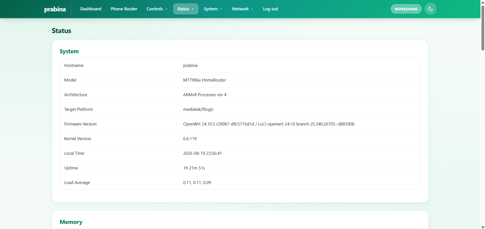
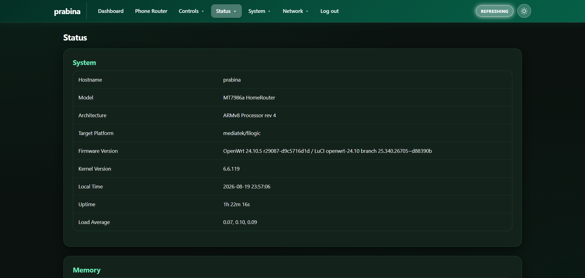

# atherBasic — Modern Emerald OpenWrt LuCI Theme

> A high-performance, ultra-clean, glassmorphism-inspired LuCI theme featuring elegant emerald green gradients, modern rounded cards, crisp typography, and an instant Light / Dark mode switcher.

---

## 🖼️ Preview

### ☀️ Light Mode (Default)


### 🌙 Dark Mode


---

## ✨ Features

* 🌿 **Emerald Green Aesthetic**: Clean white/light mint background with refined emerald/jade gradients (\#065f46\ → \#10b981\).
* 🌓 **Default Light Theme + Instant Dark Mode**: Loads in beautiful Light mode by default; includes an instant Sun/Moon theme switcher in the navbar.
* 📦 **Modern Glassmorphic Cards**: Crisp, rounded card containers with subtle mint borders and soft elevation shadows.
* ⚡ **100% Functionality Preserved**: Complete compatibility with all LuCI pages, status views, network interfaces, firewall rules, software manager, logs, and modal dialogs.
* 🚀 **Zero External Dependencies**: Lightweight CSS and SVG icons. No external CDNs, no heavy JavaScript libraries, fast on low-powered router hardware.
* 📱 **Fully Responsive**: Optimized for desktop, tablet, and mobile browsers.
* 🔄 **Built-in Cache-Busting**: Automatically serves fresh theme assets across browser sessions.

---

## 🚀 One-Command Quick Install

SSH into your OpenWrt router and run **ONE command**:

```bash
wget -qO- https://raw.githubusercontent.com/dev-prabina/openwrt_theme_24-x/main/atherBasic/install.sh | sh
```

*(or using curl)*

```bash
curl -sSL https://raw.githubusercontent.com/dev-prabina/openwrt_theme_24-x/main/atherBasic/install.sh | sh
```

---

## 🛠 Manual Installation

If you prefer to clone and install manually:

```bash
# 1. Clone repository
git clone https://github.com/dev-prabina/openwrt_theme_24-x.git /tmp/openwrt_theme_24-x

# 2. Run installer
sh /tmp/openwrt_theme_24-x/atherBasic/install.sh

# 3. Clean up temporary directory
rm -rf /tmp/openwrt_theme_24-x
```

---

## 🔄 Uninstallation / Reverting

To revert to the stock OpenWrt LuCI theme at any time:

```bash
sh /tmp/openwrt_theme_24-x/atherBasic/uninstall.sh
```

*(or run the uninstaller directly from GitHub)*

```bash
wget -qO- https://raw.githubusercontent.com/dev-prabina/openwrt_theme_24-x/main/atherBasic/uninstall.sh | sh
```

---

## 📂 Project Structure

```text
atherBasic/
├── install.sh                     # Self-contained one-line installer (with embedded assets)
├── uninstall.sh                   # One-command restoration script
├── README.md                      # Documentation
├── LICENSE                        # Apache 2.0 License
├── lightTheme.png                 # Light theme UI preview
├── darkTheme.png                  # Dark theme UI preview
└── files/                         # Unpacked source files
    ├── www/
    │   └── luci-static/
    │       ├── bootstrap/
    │       │   ├── cascade.css   # Main emerald stylesheet
    │       │   ├── mobile.css    # Responsive rules
    │       │   └── logo.svg      # Theme logo
    │       └── resources/
    │           ├── menu-bootstrap.js
    │           └── view/
    │               └── dashboard/ # Dashboard custom styles & icons
    └── usr/
        └── share/
            └── ucode/
                └── luci/
                    └── template/ # LuCI ucode templates (header, footer)
```

---

## 📄 License

Licensed under the [Apache License 2.0](LICENSE).
