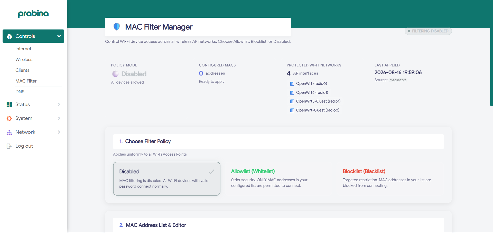

# 🛡️ MAC Filter Section

## Overview
The **MAC Filter** module manages hardware-level Access Control Lists (ACL) on Wi-Fi radios via `hostapd`.

## Features
- **Filtering Modes**:
  - **Whitelist (Allow Only)**: Only listed MAC addresses can associate.
  - **Blacklist (Block List)**: Listed MAC addresses are rejected.
  - **Disabled**: Open association.
- **Quick-Add Wizard**: Pick devices directly from active online leases with one click.
- **Bulk Import**: Paste lists of MAC addresses separated by commas or newlines.
- **Atomic Hostapd Sync**: Automatically updates `/etc/config/wireless` and reloads `hostapd` without rebooting.

## Files
- `macfilter.js`: LuCI frontend view (`/www/luci-static/resources/view/queenx/macfilter.js`).
- `luci.macfilter`: RPCD ucode backend (`/usr/libexec/rpcd/luci.macfilter`).
